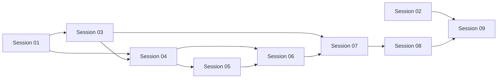

# Bộ Session Khắc Phục Giao Diện Hunt

## Cách sử dụng

Mỗi lần chỉ giao cho Jules **một** tài liệu `SESSION_XX_*.md`. Không yêu cầu Jules xử lý toàn bộ tài liệu đề xuất gốc trong một lần.

Quy tắc chung:

1. Timebox cứng tối đa 30 phút cho mỗi session.
2. Đọc session được giao và các file code nằm trong phạm vi của session đó.
3. Không mở rộng sang session kế tiếp dù còn thời gian.
4. Chạy kiểm thử ghi trong tài liệu trước khi kết thúc.
5. Ghi báo cáo theo mục "Báo cáo Jules cần để lại".
6. Nếu gặp blocker quá điểm dừng, ghi follow-up thay vì mở rộng phạm vi.

## Danh sách session

| Session | Timebox | Ưu tiên | Phụ thuộc | Trạng thái |
| --- | --- | --- | --- | --- |
| [01 - Logs auto-collapse](SESSION_01_LOGS_AUTO_COLLAPSE.md) | 20-25 phút | P0 | Không | Chưa làm |
| [02 - Log formatting](SESSION_02_LOG_FORMATTING.md) | 15-20 phút | P0 | Không | Chưa làm |
| [03 - Horizontal minsize](SESSION_03_HORIZONTAL_MINSIZE.md) | 20-25 phút | P0 | 01 nên hoàn tất (khác file, không chặn cứng) | Chưa làm |
| [04 - Vertical allocation](SESSION_04_VERTICAL_ALLOCATION.md) | 25-30 phút | P0 | 01, 03 (trùng file) | Chưa làm |
| [05 - Safe window resize](SESSION_05_SAFE_WINDOW_RESIZE.md) | 20-25 phút | P1 | 01, 04 | Chưa làm |
| [06 - Reduce empty space](SESSION_06_REDUCE_EMPTY_SPACE.md) | 20-25 phút | P1 | 04, 05 | Chưa làm |
| [07 - Narrow layout](SESSION_07_NARROW_LAYOUT.md) | 25-30 phút | P1 | 03-06 | Chưa làm |
| [08 - Visual cleanup](SESSION_08_VISUAL_CLEANUP.md) | 20-25 phút | P2 | 07 | Chưa làm |
| [09 - Acceptance validation](SESSION_09_ACCEPTANCE_VALIDATION.md) | 25-30 phút | Gate | 01-08 | Chưa làm |

## Luồng phụ thuộc

Session 01 và Session 02 có thể thực hiện độc lập. Các session còn lại nên chạy theo số thứ tự.

## Thứ tự chạy prompt

Giao từng tài liệu cho Jules theo đúng thứ tự sau (một session/một lần, chờ báo cáo trước khi giao tiếp theo):

1. `SESSION_01_LOGS_AUTO_COLLAPSE.md`
2. `SESSION_02_LOG_FORMATTING.md`
3. `SESSION_03_HORIZONTAL_MINSIZE.md`
4. `SESSION_04_VERTICAL_ALLOCATION.md`
5. `SESSION_05_SAFE_WINDOW_RESIZE.md`
6. `SESSION_06_REDUCE_EMPTY_SPACE.md`
7. `SESSION_07_NARROW_LAYOUT.md`
8. `SESSION_08_VISUAL_CLEANUP.md`
9. `SESSION_09_ACCEPTANCE_VALIDATION.md`

Ghi chú:

- Bước 2 (Session 02) không phụ thuộc gì và có thể đổi chỗ với bước 1 hoặc chạy xen giữa bước 1-3 nếu cần chia việc cho nhiều lượt; thứ tự 1→9 ở trên là thứ tự an toàn nhất, không cần suy nghĩ thêm.
- Không giao Session N+1 nếu Session N chưa ở trạng thái `Hoàn tất` (trừ cặp 01/02 có thể đảo cho nhau).
- Nếu một session bị `Bị chặn`, dừng chuỗi, xử lý blocker trước khi giao session kế tiếp — không nhảy cóc.
- Session 09 luôn là prompt cuối cùng, chỉ giao sau khi cả 01-08 đã `Hoàn tất`.

## Truy vết tiêu chí nghiệm thu

| AC | Session triển khai | Session xác nhận cuối |
| --- | --- | --- |
| AC-1 | 04, 07 | 09 |
| AC-2 | 04, 06, 07 | 09 |
| AC-3 | 03, 07, 08 (hỗ trợ) | 09 |
| AC-4 | 04, 06 | 09 |
| AC-5 | 03, 07 | 09 |
| AC-6 | 05, 07 | 09 |
| AC-7, AC-8, AC-13, AC-15 | 01 | 09 |
| AC-9 | 04, 05, 07 (cơ chế responsive nền tảng), 08 (hoàn thiện token, hỗ trợ) | 09 (chạy ma trận DPI thực tế) |
| AC-10, AC-12, AC-16 | 02 | 09 |
| AC-11 | 06 | 09 |
| AC-14, AC-17 | 09 | 09 |

## Cập nhật trạng thái

Sau mỗi session, đổi cột trạng thái thành một trong các giá trị:

- `Hoàn tất`
- `Bị chặn`
- `Cần làm lại`

Không đánh dấu `Hoàn tất` nếu lệnh kiểm thử bắt buộc chưa chạy hoặc chưa có lý do rõ ràng vì sao môi trường không chạy được.

## Hạng mục backlog (chưa có session)

Các mục sau nằm trong tài liệu đề xuất gốc nhưng chưa được gán cho session nào trong bộ 01-09. Cần quyết định đưa vào một session mới hoặc ghi nhận là để lại cho giai đoạn sau:

- **Lưu và khôi phục geometry cửa sổ** (một phần của mục 5.4) — Session 05 chỉ bật resize và đặt kích thước khởi tạo/tối thiểu, không lưu lại vị trí/kích thước giữa các lần chạy.

## Tài liệu nguồn

Các nguyên nhân, phạm vi và toàn bộ AC được định nghĩa trong [Đề xuất khắc phục giao diện](../CURRENT_UI_REMEDIATION_PROPOSAL.md). Tài liệu nguồn dùng để tra cứu và không được giao như một session triển khai.