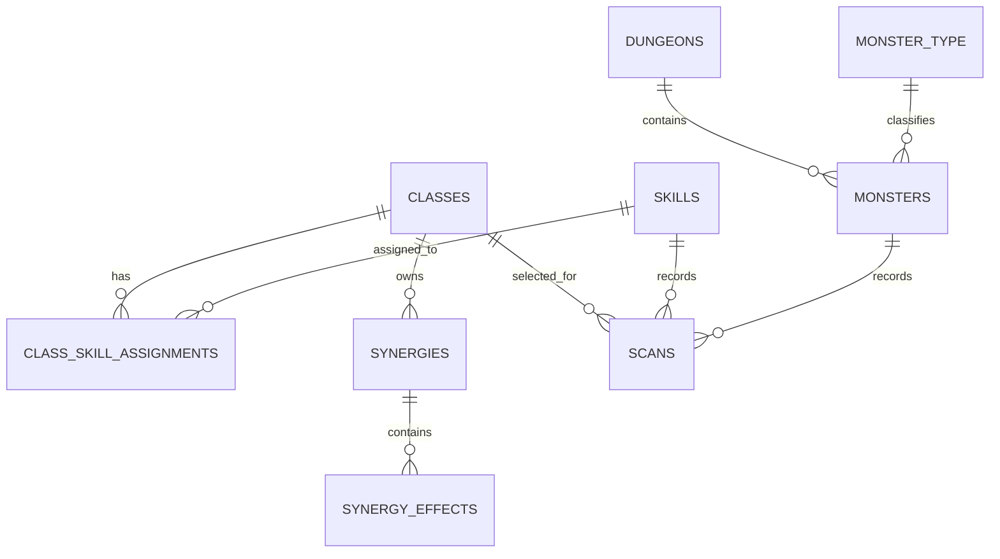

# Roadmap Cập Nhật CSDL Lớp Và Kỹ Năng

## 1. Kết quả kiểm tra hiện tại

Kiểm tra trực tiếp `monsters.db` cho thấy database có 9 bảng và foreign key không có vi phạm, nhưng dữ liệu gameplay chưa được seed đầy đủ.

| Bảng | Cột | Foreign key | Số bản ghi | Trạng thái |
| --- | ---: | ---: | ---: | --- |
| `dungeons` | 2 | 0 | 122 | Có reference data |
| `monster_type` | 2 | 0 | 3 | Có reference data |
| `monsters` | 30 | 2 | 0 | Schema đủ nhưng chưa import data |
| `classes` | 7 | 0 | 0 | Đã tạo schema, chưa seed |
| `skills` | 9 | 1 | 0 | Đã tạo schema, chưa seed |
| `synergies` | 5 | 1 | 0 | Đã tạo schema, chưa seed |
| `synergy_effects` | 6 | 1 | 0 | Đã tạo schema, chưa seed |
| `scans` | 6 | 3 | 0 | Audit/runtime table, chưa có data |
| `builds` | 5 | 1 | 0 | Future/user data table, chưa có data |

`PRAGMA foreign_key_check` hiện trả về `0` vi phạm. Điều này chỉ xác nhận schema/data hiện hữu nhất quán, không chứng minh dữ liệu class/skill đã đầy đủ.

**Báo cáo DB0 - Schema And Source Audit:**
- **Table Columns, FKs, and Counts:**
  - `classes` (7 cols, 0 FKs): 0 rows. Columns: class_id, name, description, icon_path, str_base, int_base, dex_base.
  - `skills` (9 cols, 1 FK): 0 rows. Columns: skill_id, name, alias, icon_x, icon_y, icon_w, icon_h, class_id, type. FK: class_id -> classes(class_id) RESTRICT.
  - `synergies` (5 cols, 1 FK): 0 rows. Columns: synergy_id, class_id, name, activation_sequence, recommendation. FK: class_id -> classes(class_id) RESTRICT.
  - `synergy_effects` (6 cols, 1 FK): 0 rows. Columns: effect_id, synergy_id, stat, value, duration, target. FK: synergy_id -> synergies(synergy_id) CASCADE.
  - `scans` (6 cols, 3 FKs): 0 rows. Columns: scan_id, monster_id, skill_id, class_id, timestamp, status. FKs: monster_id -> monsters(id) CASCADE, skill_id -> skills(skill_id) RESTRICT, class_id -> classes(class_id) RESTRICT.
  - `builds` (5 cols, 1 FK): 0 rows. Columns: build_id, class_id, author, description, upvote_count. FK: class_id -> classes(class_id) RESTRICT.
  - `monsters` (30 cols, 2 FKs): 0 rows. Columns: id, name, level, exp, hp, defense, attackRate, defenseRate, hpRecharge, accuracy, penetration, damageReduction, evasion, resistCritRate, primaryAttackMin, primaryAttackMax, secondaryAttackMin, secondaryAttackMax, ignoreAccuracy, ignoreDamageReduction, ignorePenetration, absoluteDamage, resistSkillAmp, resistCritDamage, resistSuppress, resistSilence, resistDiffDamage, hpProportionDamage, serverBossType, dungeonId. FKs: dungeonId -> dungeons(id) SET NULL, serverBossType -> monster_type(value) SET NULL.
  - `dungeons` (2 cols, 0 FKs): 122 rows. Columns: id, name.
  - `monster_type` (2 cols, 0 FKs): 3 rows. Columns: value, label.
  - PRAGMA foreign_key_check: 0 vi phạm (kết quả rỗng).
- **Source IDs & Parser Boundaries (Chi tiết từ DATABASE_SOURCE_DATA_MANIFEST.md):**
  - `monster_catalogue`:
    - **Đường dẫn:** `lib/data/monster-db-cabal.txt`
    - **Entity:** `monsters`, `dungeons` (từ dungeonId/locationId của quái)
    - **Boundary:** JSON array bên trong `JSON.parse('...')`
    - **Forbidden:** classes, skills, synergies
  - `dungeon_reference`:
    - **Đường dẫn:** `lib/data/location-db-cabal.txt`
    - **Entity:** `dungeons.id`, `dungeons.name`
    - **Boundary:** JS pairs `id: "name"`
    - **Forbidden:** monster/class/skill mapping
  - `monster_type_reference`:
    - **Đường dẫn:** `lib/data/type-monster-db-cabal.txt`
    - **Entity:** `monster_type.value`, `monster_type.label`
    - **Boundary:** JS objects `value`, `label`
    - **Forbidden:** class type hoặc skill type
  - `class_metadata`:
    - **Đường dẫn:** `lib/data/color-skill-character-db-cabal.txt`
    - **Entity:** `classes.class_code`, `name`, `icon_path`, `str_base`, `int_base`, `dex_base`
    - **Boundary:** class map includes all base attributes; `class_code` normalizes hyphen/underscore consistently
    - **Forbidden:** full skill catalogue, class-skill assignment, synergy effects
    - **Expected Count:** 9 classes (blader, warrior, wizard, dark-mage, force-archer, force-shielder, force-blader, gladiator, force-gunner)
  - `skill_sprite_catalogue`:
    - **Đường dẫn:** `lib/data/skill-db-cabal-2.txt`
    - **Entity:** `skills.skill_code`, `icon_x`, `icon_y`, `icon_w`, `icon_h`
    - **Boundary:** embedded `sprites` JSON with coordinate objects
    - **Forbidden:** class ownership, skill type, cooldown/cast time, recommendation, file `image-count-skill-db-cabal.txt`
    - **Expected Count:** 460 skills
  - `bm3_synergy_catalogue`:
    - **Đường dẫn:** `lib/data/bm2-bm3-skill-db-cabal.txt`
    - **Entity:** `synergies`, `synergy_effects`
    - **Boundary:** map keyed by class slug; `rows` with `synergyName`, `activationSequence`, `recommendation`, `effects`
    - **Forbidden:** full class-skill mapping, complete game skill catalogue, ép kiểu sớm hoặc lược bỏ nguyên bản (`value_text`)
    - **Expected Count:** 35 synergies, 120 effects liên kết với 9 classes
  - `class_skill_evidence`:
    - **Đường dẫn:** `lib/data/bm2-bm3-detail-skill-db-cabal.txt`
    - **Entity:** mapping manifest cho DB5
    - **Boundary:** class-guide objects with `className`, `slug`, `featuredSkillSections`, `skillSlugs`, `comboSection`
    - **Forbidden:** direct production seed, generic sprite ownership
  - `user_skill_library`:
    - **Đường dẫn:** `lib/data/skills.json`
    - **Entity:** User-configured skill library only
    - **Boundary:** JSON list: `name`, `key`, `type`, `cooldown`, `cast_time`, `image`
    - **Forbidden:** canonical `skills` catalogue, class metadata, automatic class-skill mapping
  - `monster_user_library`:
    - **Đường dẫn:** `lib/data/monsters.json`
    - **Entity:** User-created hunt/rotation configuration only
    - **Boundary:** JSON user state
    - **Forbidden:** canonical `monsters` source, dungeons, class/skill data
- **Canonical Mapping Availability:** Hiện **chưa có** một mapping nguồn chính thức nào (canonical source) kết nối trực tiếp toàn bộ 460 skill catalogue với 9 class. Việc gán skill phải chờ DB5 (lập mapping manifest có bằng chứng từ `class_skill_evidence`) trước khi seed vào bảng liên kết `class_skill_assignments`. `skills.json` chỉ là cấu hình của người dùng.
- **Blockers:** Thiếu bảng quan hệ many-to-many (`class_skill_assignments`), thiếu định danh unique source codes (cần chạy DB1), và không thể dùng dữ liệu UI (như `skills.json`) làm catalogue chính thức.

## 2. Nguồn dữ liệu đã có

Chi tiết source ID, file chính xác, parsing boundary, identity, forbidden look-alike sources và evidence requirements nằm trong [DATABASE_SOURCE_DATA_MANIFEST.md](DATABASE_SOURCE_DATA_MANIFEST.md). Mọi DB session phải dùng manifest này trước khi đọc hoặc seed data.

| Nguồn | Dữ liệu có thể dùng | Mức độ cấu trúc | Quyết định |
| --- | --- | --- | --- |
| `lib/data/color-skill-character-db-cabal.txt` | 9 class slug, tên class, icon path, base STR/INT/DEX | JavaScript bundle, cần extractor có kiểm thử | Seed bảng `classes` |
| `lib/data/skill-db-cabal-2.txt` | 460 skill sprite entries với `icon_x`, `icon_y`, `icon_w`, `icon_h` | JSON embedded trong webpack | Seed catalogue icon, không tự suy diễn class ownership |
| `lib/data/bm2-bm3-skill-db-cabal.txt` | 9 classes, 35 BM3 synergies, 120 effects | JavaScript object, cần extractor có kiểm thử | Seed `synergies` và `synergy_effects` |
| `lib/data/bm2-bm3-detail-skill-db-cabal.txt` | Class guide, skill slug list, mô tả/categorization | Bundle lớn, nhiều content prose | Chỉ dùng sau audit parser; không làm source canonical một cách mù quáng |
| `lib/data/skills.json` | 5 skill do người dùng cấu hình, key/cooldown/cast_time/image | JSON | Giữ là user skill library, không thay catalogue game |
| `lib/data/monster-db-cabal.txt` | Monster source | Webpack JSON | Import riêng; không gộp vào migration class/skill |

Hiện chưa có nguồn canonical, structured và versioned chứng minh đầy đủ quan hệ `skill ↔ class` cho toàn bộ catalogue. Vì vậy không được đánh dấu “skills theo từng class đã đầy đủ” trước khi có extractor/audit xác nhận.

## 3. Vấn đề thiết kế cần giải quyết

### 3.1 Schema hiện tại không biểu đạt đầy đủ quan hệ skill-class

`skills.class_id` biểu đạt một skill thuộc tối đa một class. Điều này không phù hợp nếu có skill dùng chung hoặc cần lưu một skill catalogue độc lập rồi gán cho nhiều class. Migration phải thêm bảng liên kết, không phá `skills.class_id` trong lần đầu:

```sql
CREATE TABLE IF NOT EXISTS class_skill_assignments (
    class_id INTEGER NOT NULL,
    skill_id INTEGER NOT NULL,
    category TEXT NOT NULL,
    source_ref TEXT NOT NULL,
    is_recommended INTEGER NOT NULL DEFAULT 0,
    PRIMARY KEY (class_id, skill_id),
    FOREIGN KEY (class_id) REFERENCES classes(class_id) ON DELETE CASCADE,
    FOREIGN KEY (skill_id) REFERENCES skills(skill_id) ON DELETE CASCADE
);
```

`category` ghi ngữ cảnh như `bm1`, `bm2`, `bm3`, `attack`, `buff`, `debuff`, `passive`, `utility`; không suy diễn category nếu source không khẳng định.

### 3.2 Identity chưa ổn định

`classes.name` và `skills.name` chưa có unique key machine-safe. Thêm immutable source key trước khi import:

```sql
ALTER TABLE classes ADD COLUMN class_code TEXT;
ALTER TABLE skills ADD COLUMN skill_code TEXT;
CREATE UNIQUE INDEX IF NOT EXISTS idx_classes_class_code
    ON classes(class_code) WHERE class_code IS NOT NULL;
CREATE UNIQUE INDEX IF NOT EXISTS idx_skills_skill_code
    ON skills(skill_code) WHERE skill_code IS NOT NULL;
```

Không dùng display name làm khóa import; dùng normalized slug/source code và giữ `name` là display text.

### 3.3 `synergy_effects.value REAL` làm mất dữ liệu source

Nguồn synergy có value như `+30%`, `-3% (scaled)` và `+500`. Một cột `REAL` không đủ để giữ unit, sign và scaling. Migration additive cần ít nhất:

```sql
ALTER TABLE synergy_effects ADD COLUMN value_text TEXT;
ALTER TABLE synergy_effects ADD COLUMN value_number REAL;
ALTER TABLE synergy_effects ADD COLUMN value_unit TEXT;
ALTER TABLE synergy_effects ADD COLUMN is_scaled INTEGER NOT NULL DEFAULT 0;
```

Luôn giữ `value_text` nguyên bản. `value_number`, `value_unit`, `is_scaled` là parsed fields có thể null khi parser không chắc chắn.

## 4. Mô hình quan hệ mục tiêu

Relationship contract chi tiết gồm cardinality, khóa, foreign-key action, thứ tự seed và orphan checks nằm trong [DATABASE_RELATIONSHIP_CONTRACT.md](DATABASE_RELATIONSHIP_CONTRACT.md). DB1, DB4, DB6 và DB8 phải dùng contract này khi migration, import và validation.

Database catalogue không thay thế các JSON runtime đang phục vụ UI. Quy tắc UI-to-DB mapping, adapter, fallback và dependency nằm trong [UI_DATABASE_INTEGRATION_CONTRACT.md](UI_DATABASE_INTEGRATION_CONTRACT.md); DB7 chỉ được cung cấp read adapter sau khi catalogue/mapping có evidence đầy đủ.



`skills` là catalogue chuẩn của game. `lib/data/skills.json` vẫn là user library/runtime configuration và chỉ có thể tham chiếu catalogue qua `skill_code` trong một session riêng có backward-compatibility plan.

## 5. Kế hoạch thực hiện theo session

Mỗi session tối đa 30 phút; dừng mở rộng scope ở phút 25, chạy validation và chỉ dùng 5 phút cuối để sửa lỗi trực tiếp hoặc hoàn tác diff của session bằng patch review. Không dùng reset/discard worktree rộng.

| Thứ tự | Session | Timebox | Mục tiêu | Dependency |
| --- | --- | ---: | --- | --- |
| DB0 | Snapshot & source audit | 20-25 phút | Ghi schema, counts, FK, source counts và parser feasibility | Không |
| DB1 | Additive schema migration | 25-30 phút | Thêm identity/mapping/effect-value schema, không seed | DB0 |
| DB2 | Seed classes | 25-30 phút | Extract/seed đúng 9 classes, idempotent | DB1 |
| DB3 | Seed skill sprite catalogue | 25-30 phút | Extract/seed icon metadata, idempotent; chưa gán class | DB1 |
| DB4 | Seed BM3 synergies | 25-30 phút | Seed 35 synergies/120 effects cho 9 classes | DB2, DB1 |
| DB5 | Class-skill mapping audit | 20-25 phút | Xác định coverage có chứng cứ; lập mapping manifest thiếu data | DB2, DB3 |
| DB6 | Import verified class-skill mapping | 25-30 phút | Chỉ import mapping có source evidence | DB5 |
| DB7 | Runtime integration | 25-30 phút | Đọc catalogue DB mà không thay user library behavior | DB2-DB6 |
| DB8 | Integrity tests & docs sync | 20-30 phút | Test FK, counts, idempotency, orphan rows và cập nhật docs | DB1-DB7 |

Không chạy DB6 khi DB5 chưa chứng minh được mapping. Không coi `skills.json` năm entry là bằng chứng catalogue kỹ năng đầy đủ.

## 6. Tiêu chí hoàn thành

- Bảng `classes` có đúng 9 class source codes, unique và có base stats/icon path khi source cung cấp.
- `skills` có catalogue icon metadata với source key unique; số row phải khớp parser count, không dùng số hard-code trong code.
- `class_skill_assignments` chỉ chứa mapping đã được source audit xác nhận; không có orphan `class_id`/`skill_id`.
- `synergies` và `synergy_effects` seed idempotent; lưu nguyên `value_text` để không mất `%` hoặc `(scaled)`.
- `PRAGMA foreign_key_check` trả về 0; test đầy đủ count, unique key và orphan rows.
- Monster import được kiểm tra/seed độc lập; không tuyên bố toàn DB complete khi `monsters` còn 0 rows.
- User skill library giữ nguyên behavior và không bị overwrite bởi catalogue seed.

## 7. Validation bắt buộc

```text
PRAGMA foreign_key_check;
SELECT COUNT(*) FROM classes;
SELECT COUNT(*) FROM skills;
SELECT COUNT(*) FROM class_skill_assignments;
SELECT COUNT(*) FROM synergies;
SELECT COUNT(*) FROM synergy_effects;
SELECT COUNT(*) FROM skills WHERE skill_code IS NULL;
SELECT COUNT(*) FROM class_skill_assignments csa
LEFT JOIN classes c ON c.class_id = csa.class_id
LEFT JOIN skills s ON s.skill_id = csa.skill_id
WHERE c.class_id IS NULL OR s.skill_id IS NULL;
```

Mỗi importer chạy hai lần trong temporary SQLite database và production copy backup: row count và unique key phải không đổi ở lần hai.