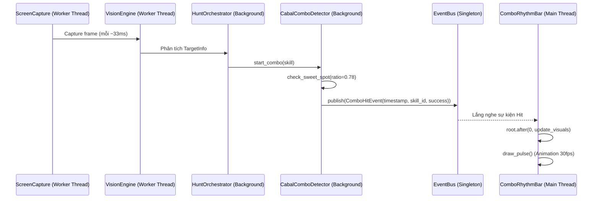

# Thiết kế Kiến trúc Auto Hunt (UI-Logic Decoupling)

## 1. Mục tiêu
Thiết kế lại luồng tương tác giữa UI và Logic ngầm (Background Logic) để loại bỏ hiện tượng đơ (freeze) và văng ứng dụng (crash), đồng thời cải thiện luồng sử dụng kéo thả (Drag & Drop) kỹ năng.

## 2. Kiến trúc Decoupled bằng EventBus

Mọi giao tiếp từ Logic sang UI phải hoàn toàn thông qua `EventBus` thay vì tham chiếu vòng (Circular reference) hoặc gọi hàm trực tiếp.

### 2.1. Sơ đồ Luồng Combo (Sequence Diagram)



### 2.2. Giao tiếp EventBus (Event Definitions)
Thay vì truyền mảng dữ liệu nặng liên tục, chúng ta sử dụng tín hiệu (Signals):

```python
@dataclass
class ComboHitEvent:
    timestamp: float
    skill_id: int
    success_rate: float
    is_sweet_spot: bool

@dataclass
class TargetDiedEvent:
    target_id: int
    timestamp: float
```

## 3. Thiết kế Giao diện Skill (Drag & Drop)

### 3.1. Interface `SkillPresetService`
Logic Service độc lập để cấp phát danh sách Skills:

```python
class ISkillPresetService(Protocol):
    def get_available_skills(self, class_id: int) -> List[Dict[str, Any]]:
        """Trả về danh sách kỹ năng khả dụng cho một Class."""
        ...

    def save_timeline_slots(self, lane: str, skill_ids: List[int]) -> bool:
        """Lưu lại thứ tự kỹ năng trên dải timeline."""
        ...
```

### 3.2. Drag & Drop trong Tkinter
Vì Tkinter không hỗ trợ Native DND mượt mà giữa các Widget (không dùng thư viện ngoài), ta sử dụng custom binding:

1. **State:** Một Global Dictionary lưu trạng thái kéo `_drag_state = {"widget": None, "skill_data": None}`.
2. **Bind Events:**
   - `<ButtonPress-1>` trên `SkillIcon` (Lưới Available): Lưu dữ liệu vào `_drag_state` và vẽ một cửa sổ/canvas overlay nhỏ chạy theo con trỏ chuột (`<B1-Motion>`).
   - `<ButtonRelease-1>`: Kiểm tra tọa độ thả chuột. Nếu rơi vào vùng của `SkillTimelineStrip`, tính toán vị trí index thả (dựa vào `winfo_pointerx`) và gọi hàm `insert_skill(index, data)`.
   - Cập nhật lại Timeline UI và gọi `SkillPresetService.save_timeline_slots()`.

## 4. UI Rendering Tối ưu (Tránh Block Main Thread)

1. **TargetStatusPanel:** Không đè (override) các hàm built-in của Tkinter như `itemconfig`. Lắng nghe EventBus và gọi `root.after(0, update_hp_bar)`.
2. **SkillStatsPanel:** Dùng Unicode Blocks trong Treeview cell thay vì custom widgets.
   - Hàm `def format_progress_bar(percent: float, length: int = 10) -> str`
   - Ví dụ 70% -> `███████░░░`
   - Font bắt buộc: Monospaced (ví dụ `Consolas` hoặc IBM Plex Mono) để các thanh có độ dài cố định.

## 5. Kế hoạch Chuyển đổi (Migration & Rollback Plan)

### 5.1. Feature Flag / Chuyển đổi từ từ
- Không xóa ngay các class cũ (`SkillPanel`, `combo_dropdowns`).
- Tạo một file UI mới `ui/panels/skill_panel_v2.py`.
- Khai báo một cờ (flag) trong `config.json` ví dụ `"use_new_skill_panel": true`.
- Nếu quá trình refactor gây lỗi, user (hoặc hệ thống) có thể đổi cờ thành `false` để quay về UI cũ.

### 5.2. Rollback Strategy
- Tất cả commit trong giai đoạn Refactor UI phải nhỏ (Atomic Commits).
- Giữ vững Database Schema và JSON config schema hiện tại. Phần UI mới sẽ parse/map dữ liệu tương thích với config hiện tại. Việc đổi cấu trúc config sẽ được tách ra Sprint khác.
